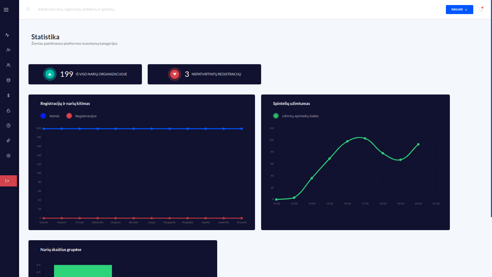

# Showcase

<!-- ### The locker part
 -->

# Project idea
A dance studio asked us (the [Sprucebird](https://github.com/sprucebird) team ) to make them an internal system for managing dancer data, logging their entries and payments as well as controlling smart lockers. A challenging set of tasks for sure, which is exactly what got us interested. The prototypes are all built and the above video demonstrates our first tests with the lockers. 

# Framework
The framework used is [Laravel](https://laravel.com/)

# Data managment
To manage our data, we used a relational mysql database as well as [Firebase](https://firebase.google.com/) real time database and deployed everything to a [Digitalocean](https://www.digitalocean.com/) virtual machine. 

# Hardware
RFID scanners. We use RFID scanner information to log user entries. RFID scanners feed text information directly to the system.

Custom lockers. We use [Arduino](https://www.arduino.cc/) microcontrollers to control electromagnetically locked lockers. When an entry is logged in the system, a locker is assigned to the user and is automatically opened through the Firebase real time database.
The code we used for the ESP-32 microcontroller can be found at [Stream_callback.ino](./Stream_callback.ino)

# Why we don't share the code
We programmed the system being inexprienced and willing to learn. While learning of course we made some mistakes that might still be lingering somewhere in the code. Usually that would not be a problem, except for that this system is still being used as a convienience tool and due to that we would not like to cause any inconvenience for it's users.
